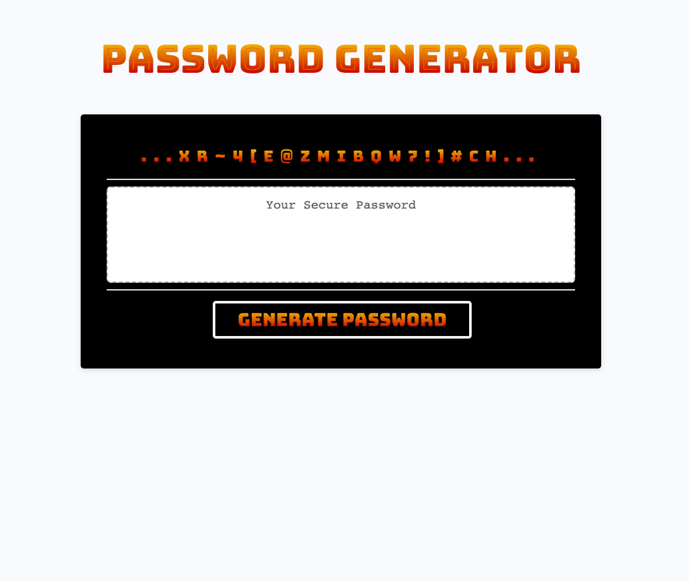

# PASSWORD GENERATOR

## Description

A simple and effective application for creating unique passwords with character categories you choose.

- To create something quick and easy for generating passwords.
- It can be challenging to think of a unique password that meets certain criteria.  This helps solve that!
- Lots of JavaScript!

## Table of Contents

- [Installation](#installation)
- [Usage](#usage)
- [Credits](#credits)
- [License](#license)

## Installation

Copy and paste the URL into your favorite browser.

## Usage

Click the Generate Password button and follow the prompts.

## Credits

Google Fonts

## License

MIT License

## Questions

- Email: putzstuck@gmail.com
- GitHub Profile: https://github.com/argounova