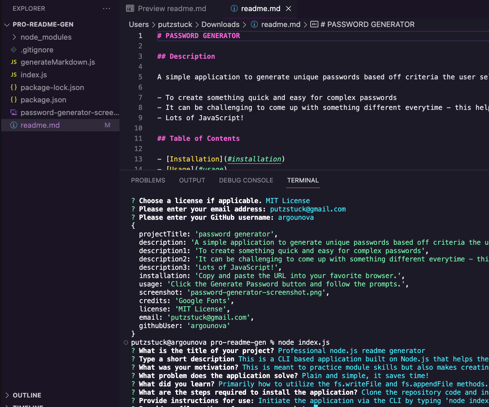

# PROFESSIONAL NODE.JS README GENERATOR

## Description

This is a CLI based application built on Node.js that helps the user to create a professional README.md file.

- This is meant to practice module skills but also makes creating a README for future projects much simpler.
- Plain and simple, it saves time!
- Primarily how to utilize the fs.writeFile and fs.appendFile methods.

## Table of Contents

- [Installation](#installation)
- [Usage](#usage)
- [Credits](#credits)
- [License](#license)

## Installation

Clone the repository code and install inquirer v8.2.4

## Usage

Initiate the application via the CLI by typing 'node index.js' and hitting Enter. Then answer the questions.

## Credits

N/A

## License

MIT License

## Questions

- Email: putzstuck@gmail.com
- GitHub Profile: https://github.com/argounova